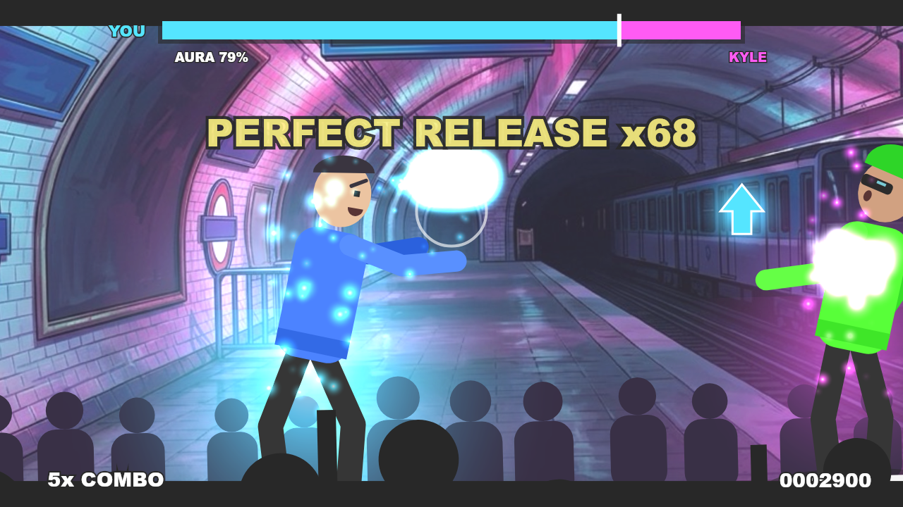
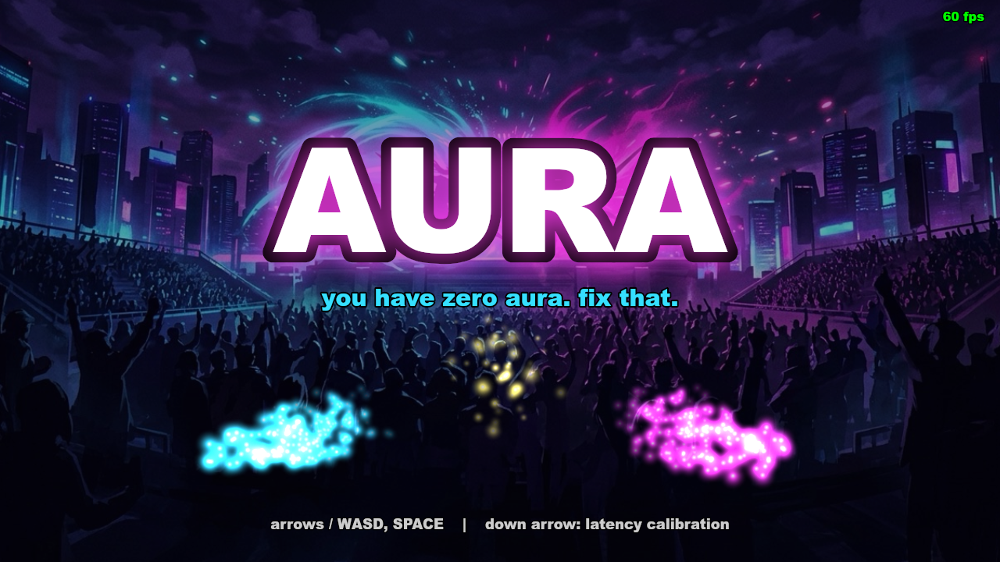
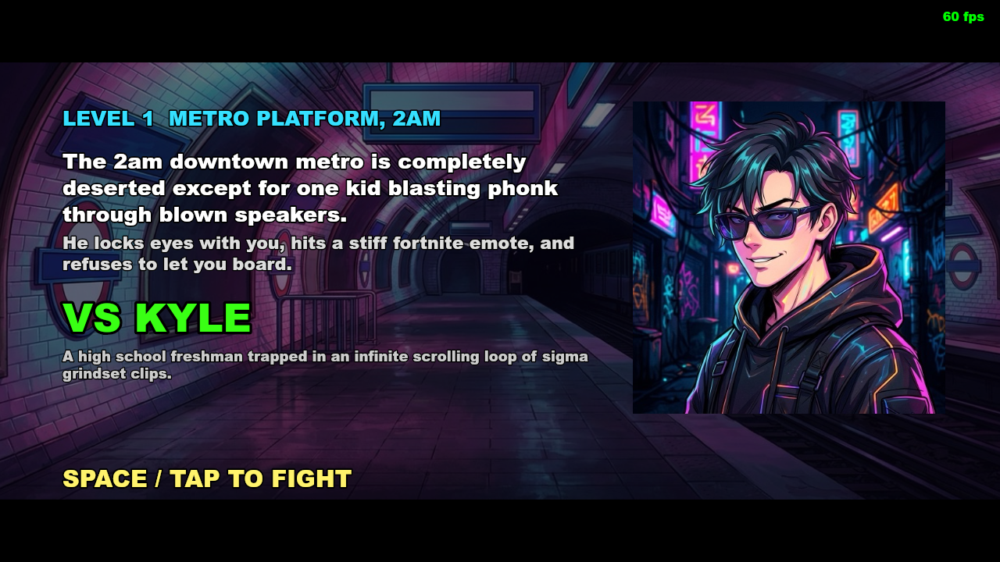
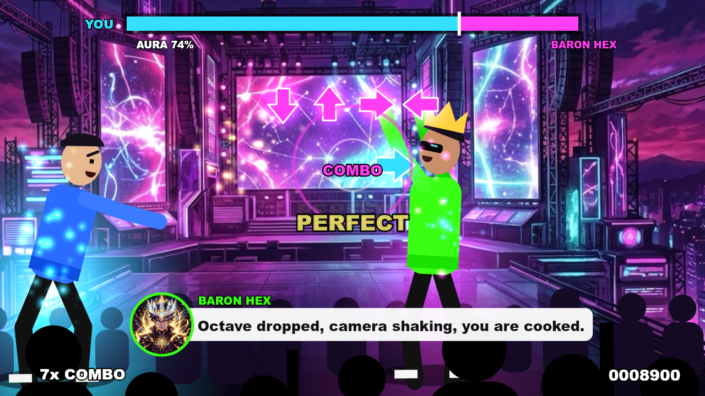
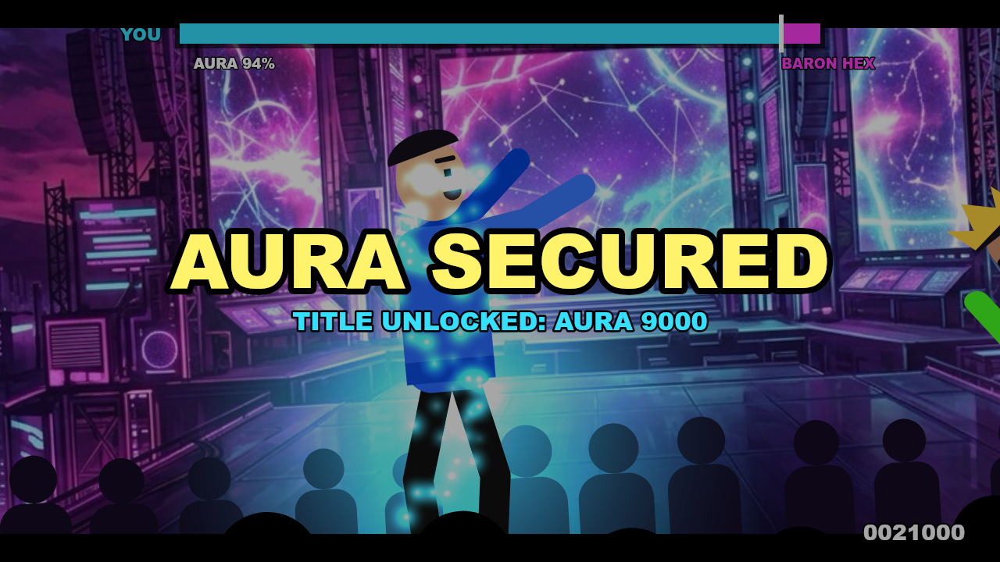

# AURA

**A 3D cinematic aura battle rhythm game, TikTok phonk edit mood: you start with zero aura, and every beat you land steals some from your opponent while the crowd screams.**

Built at the {Tech: Europe} AI Gaming Hack, Paris, by team Itchy & Scratchy (Dylan Merigaud, Dorian Poupard). Co hosts Google DeepMind and Voodoo.

Play:
- 3D, the main game: https://dylanmerigaud.github.io/aura/v2/
- 2D, the original build, the fallback: https://dylanmerigaud.github.io/aura/

The 3D version is the main game, the 2D version is the fallback.



| | |
|---|---|
|  |  |
|  |  |

These screenshots are from the 2D build, taken headlessly (see Architecture below). The 3D build renders live on a WebGL canvas, no capture pipeline for it yet.

## The game

You have zero aura. Fix that. Five aura battles, cinematic camera cuts on every downbeat, a crowd that reacts to who is winning, and a soundtrack built from the beat grid up: every QTE you land is timed against the track's own onsets, not a generic click. Each fight is a tug of war: land the rhythm QTEs on the beat and the aura bar slides toward you, miss and it slides toward your opponent. First side to push the bar to the edge, or whoever is ahead when the song ends, wins.

## How to play

A tug of war aura bar sits at the top of the screen. Land QTEs on the beat to push it toward you, miss and it slides to your opponent. Bar at an edge, or song over: the side with more aura wins.

| QTE | Keyboard | Touch |
|---|---|---|
| HIT | the arrow key (or WASD), on the beat | swipe that direction, or tap the outer edge |
| COMBO | the arrow sequence in order, last press on the beat | swipes in order |
| HOLD | hold SPACE, release on the target beat | hold anywhere, release on the target beat |
| MASH | alternate LEFT and RIGHT as fast as you can, SPACE to release | tap the left or right half, tap the center third to release |

A MASH release is "the 69": the alternations you land (capped at 3 per beat of the window, no turbo key cheese) times a release timing multiplier (Perfect x2, Great x1.5, Ok x1, early or late x0.5) becomes a burst number punched onto the screen and a matching swing of the aura bar.

Timing windows: Perfect 45 ms, Great 90 ms, Ok 130 ms, anything wider is a miss. A window scale per level tightens all three as the campaign escalates. Pressing the wrong arrow on a HIT or a COMBO is graded "cringe", not just a miss: it costs more aura than a normal miss and gets its own reaction.

Combo multiplier on score: x2 at a 10 combo, x3 at 25, x4 at 50. Any miss or cringe resets the combo to zero. The aura flame around you changes color and grows with the combo (blue at 5, purple at 15, sunglasses on at 25).

**The tempo rule**: every judged press nudges the song's playback rate, Perfect and Great speed it up, a miss or a cringe slows it down, eased in over 250 ms and decaying back to 1.0x at 1 percent a second, clamped between 0.9x and 1.15x. Land clean and the song itself starts running hot under you.

**Stars**: 3 stars on a win with 90 percent or better accuracy and zero cringe, 2 stars at 80 percent or better, 1 star on any other win, 0 on a loss. Best score, accuracy, burst and stars per level are saved to localStorage, per device.

**Latency calibration**: Settings, LATENCY CALIBRATION. A 16 tick metronome plays, tap SPACE (or tap the screen) on each click after the first four, and the median of the residuals between your taps and the heard beat is saved and applied on top of the latency the browser reports. Redo it if your speakers or headphones change.

## Campaign

| Level | Place | Opponent | Track (measured BPM) | Window scale |
|---|---|---|---|---|
| 1 | The club, peak phonk hour | DJ Montagem | level4, about 129 BPM | 1.0 |
| 2 | Metro platform, 2am | Kevin from Marketing | level1, about 99 BPM | 0.95 |
| 3 | Kebab shop, 4am | Mehdi Aura | level2, about 103 BPM | 0.9 |
| 4 | Parvis de Notre Dame, dawn | His Holiness | level3, about 110 BPM | 0.85 |
| 5 | The Voodoo stage, final boss | The Algorithm | boss, about 136 BPM | 0.75 |

Level 1 is the hero fight, hand charted on its own track's onsets so the first thing a judge plays is the most cinematic. Levels 2 to 5 are charted by a seeded, deterministic generator that reads each track's drops, breakdowns and onset strengths (`src/v2/levels.ts`) so the QTE script always lands on the music. The level 5 boss has a phase two at the track's midpoint: the music drops an octave, the camera goes handheld, and the QTE spacing tightens for the rest of the fight.

MULTIPLAYER and LOADOUT already sit on the title menu, greyed out (see What is next below).

## Partner technologies

**Google DeepMind Gemini**

- `gemini-3.8-flash` (falling back to `gemini-3.5-flash-lite`), called with structured JSON output, writes the story, opponent persona and color, taunts and announcer lines for every level, and, for the original 2D campaign, the QTE event script itself. Scripts: `scripts/gen-campaign.ts` (the 2D campaign and its QTE script), `scripts/gen-cast.ts` (the fixed v2 cast: DJ Montagem, Kevin from Marketing, Mehdi Aura, His Holiness, The Algorithm), graded by `scripts/eval-text.ts`.
- `gemini-3.1-flash-image` ("Nano Banana 2") painted the level backgrounds, opponent portraits and the title art. Script: `scripts/gen-art.ts`.
- The live "roast your run" line on the results screen also calls `gemini-3.8-flash`, through the Cloudflare Worker below, so the shipped build never holds a Gemini key.

**Lyria**

- `lyria-3.5` generated the five level tracks and the victory stinger, `lyria-3-clip-preview` generated the title loop and the boss's phase two clip. Catalogued with model, requested and measured BPM, first beat and duration in `assets/music/manifest.json`.

**Gradium**

- TTS voices every taunt and announcer line, rendered offline to `public/voice` (the 2D campaign, `scripts/gen-voices.ts`) and `public/voice/v2` (the 3D cast, `scripts/gen-voices-v2.ts`), REST endpoint, opus transcoded to mp3 by ffmpeg.
- The live "roast your run" voice line on the results screen also calls Gradium, through the Cloudflare Worker below.

**Cloudflare Worker**

- `worker/` is a small TypeScript Worker, deployed at https://aura-proxy.dylanmerigaud-pro.workers.dev, that fronts live Gemini roasts and live Gradium voice so the static build never ships an API key at runtime for these two live calls. Rate limited per IP in a KV namespace, CORS locked to the game's own origins. Called from `src/v2/net/live.ts` (`fetchRoast`, `speakLive`), with a bundled fallback line if the network call fails or times out. See `worker/README.md` for routes, deploy and local dev.

All build time generation (campaign, cast, art, music, voices) runs offline, cached by content hash. The published game is static and keyless: no API key ever reaches the browser except through the Worker's own proxy calls.

## Architecture

- `src/qte`: the engine agnostic QTE judge and runner, shared by both builds. `judge.ts` turns a timing offset into a grade and computes the combo and release multipliers, `runner.ts` is the pure beat grid state machine (no DOM, no audio), `types.ts` the shared campaign and QTE data types, `validate.ts` checks a generated level against the beat grid and content rules, `input.ts` maps keyboard and touch onto the audio clock (2D build).
- `src/v2/core.ts`: the 3D battle core, BattleCore. Reads QteRunner results, drives the aura meter, score, combo, the tempo rule and the MASH burst, emits `CoreEvent`s and a per frame `Frame`. Pure: no DOM, no three.js, no audio.
- `src/v2/clock.ts`: SongClock, maps AudioContext time to track seconds through piecewise constant playback rates, so the beat grid and the music stay locked while the tempo rule bends the song's speed.
- `src/v2/tempo.ts`: Tempo, the pure state machine behind the tempo rule (nudge, ease, decay).
- `src/render3d`: the 3D stage. `stage.ts` owns the ring set, the two fighters, the crowd and a PS2 style low res render target with bloom; `director.ts` is the pure camera shot picker (cut on downbeats, speed ramp before a drop, punch zoom); `fighters.ts` loads the Mixamo cast (falling back to three.js's RobotExpressive) and maps QTE events to animation clips; `set.ts` and `crowd.ts` build the ring and the instanced crowd; `vfx/` is the aura flames, sparks, shockwaves, the MASH orb and the fullscreen composite pass (chroma split, glitch, vignette, flashes).
- `src/v2/ui`: the DOM HUD and every screen (title, map, VS card, battle HUD, results, settings, loadout), assembled in `app.ts`. `hud/` holds the meter and tachometer, the QTE prompt layer, and the transient popups (grade, burst number, taunts).
- `src/audio/layers.ts`: the 3D build's synthesized layered mix, the Lyria track bus with a lowpass riser and sidechain duck, the crowd bed, and every judged, release and story one shot, scheduled on `ctx.currentTime`, built on the shared primitives in `src/audio/engine.ts`, `sfx.ts` and `crowd.ts`.
- `src/game`, `src/ui`, `src/main.ts`: the 2D build kept as the fallback, unchanged: Canvas 2D rendering, the procedural character rig, particles and the screen state machine.

The `AudioContext` clock is the single source of truth for timing in both builds: `heardTime()` in `src/audio/engine.ts` turns a DOM event's timestamp into the audio time the player was actually hearing at that instant (output latency included), so what you see, what you hear and what gets judged agree. `SongClock` extends that into variable speed playback so the tempo rule never desyncs the beat grid from the music. The QTE runner itself is pure beat grid math with no DOM or audio dependency, which is what makes it directly unit testable and reusable headlessly (the 2D build's `scripts/snap.ts`, `scripts/snap-screens.ts` and `scripts/sim.ts` import the real game code into Node against a fake `AudioContext` and DOM, rendering with `@napi-rs/canvas`).

## Timing and latency

Every input is timestamped on the heard audio clock, not the frame clock: a dropped frame never shifts a judgment. The song plays at a variable rate under the tempo rule, so the beat grid is expressed in track seconds and converted through `SongClock`, never assumed constant. Calibration (Settings, LATENCY CALIBRATION) measures your personal offset once and folds it into every later heard time; redo it after changing audio output.

## Evals

Amendment 10's rule: nothing generated ships without passing its gate, a fail regenerates then falls back to the best scored candidate, never to silence. Every gate writes a row to `evals/ledger.jsonl`. Current counts (all rows ever written, including retries):

| kind | pass | fail | total |
|---|---:|---:|---:|
| music | 35 | 5 | 40 |
| pacing | 20 | 0 | 20 |
| text | 209 | 35 | 244 |
| voice | 30 | 0 | 30 |

Every generated thing passes a gate before it ships, and every gate writes a row to `evals/ledger.jsonl`. `pnpm evals` runs the two mechanical gates, pacing (every chart: overlaps, dead spans, first QTE, level length, on screen text, the 69 release on a drop) and animation (every Mixamo clip: beat windows, root drift, loop seams, and the mechanical half of the ten instant cringe kills), prints a table, exits 1 on any fail and rewrites the line below. What each gate checks and why: [docs/evals.md](docs/evals.md).

Evals: 413 checks, 334 pass, 79 fail, last run 2026-09-26T14:10:52.366Z

Full gate definitions and what actually shipped: `docs/evals.md`. A full pass over the mood spec against the running code, item by item: `docs/mood-audit.md`.

## Credits

- Mixamo (characters and animation clips, `assets/3d/`): Adobe's own terms allow royalty free commercial and non commercial use, no attribution required. Full source list: `assets/3d/LICENSES.md`, `assets/3d/manifest.json`.
- three.js RobotExpressive (`assets/3d/fallback/RobotExpressive.glb`): MIT, the fallback rig when a Mixamo file is missing.
- Anton font (the 3D HUD's display type): SIL Open Font License, loaded from Google Fonts.
- Everything else (art, music, voices, level scripts, the 2D game's characters, particles and SFX) is generated by the partner models above or synthesized at runtime in Web Audio and Canvas 2D. No sample from any commercial source anywhere in the game.

## Build and deploy

```
pnpm i
pnpm dev      # esbuild dev server, watch: v1 at http://localhost:5173, v2 at /v2/
pnpm build    # static production build in dist/ (both builds)
pnpm zip      # build then aura-itch.zip, for itch.io
pnpm test     # vitest: judge, runner, validate and render3d tests
pnpm pages    # build then force-push dist/ to the gh-pages branch
```

Regenerating content (`pnpm gen:campaign`, `pnpm gen:art`, `pnpm gen:voices`, and the v2 equivalents run directly with `tsx`) needs API keys, but never from the repo: they are read from the macOS keychain (`gemini-api-key-hackathon`, falling back to `gemini-api-key`, and `gradium-api-key`) at generation time only. The shipped build never talks to these services directly.

The Cloudflare Worker lives in its own package with its own install, secrets and deploy flow: see `worker/README.md`.

## Performance

FPS: laptop <to measure>, phone <to measure>.

## What is next

Multiplayer, same room, same beat, so two players trade the same aura bar live, and loadouts, a read only preview of the four move cards already unlocked by finishing the campaign, later a pick between them. Both already sit on the title menu, greyed out, waiting on their systems.
